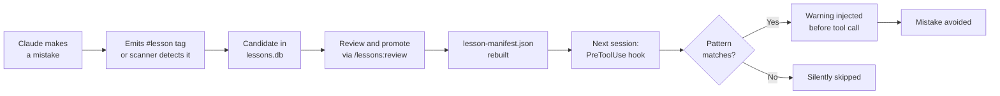
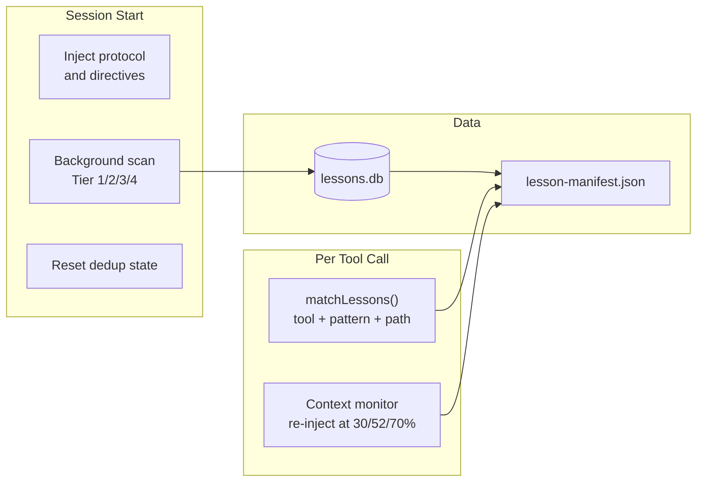

# lessons-learned

[](https://github.com/joeblackwaslike/lessons-learned/actions/workflows/ci.yml)
[](LICENSE)
[](package.json)

> Stop repeating Claude's mistakes. Every session, automatically.



```bash
claude /plugin install lessons-learned@agent-marketplace
```

- **Captures** mistakes from session logs — structured tags and heuristic scanning
- **Injects** relevant warnings before tool calls at the exact moment they're needed
- **Compounds** — every session adds to a persistent store that follows you across projects

---

## Why this exists

Claude is stateless. Every session forgets every correction, every footgun hit, every `git stash` that silently dropped untracked files. Over long agentic runs, the same class of mistake appears again and again — because nothing carries forward.

lessons-learned creates a persistent, compounding memory of failure patterns. Mistakes are captured automatically from session logs. A background scanner extracts candidates, you promote the ones worth keeping, and the next time Claude is about to make the same move, a warning surfaces at the exact tool call where it matters.

The feedback loop tightens over time. The more sessions, the stronger the prevention.

---

## See it in action

**Step 1 — Claude makes a mistake and emits a lesson tag:**

```
#lesson
tool: Bash
trigger: git stash
problem: git stash silently omits untracked files — they stay in the working tree
         and are not stashed. Running git stash with new files present loses them.
solution: Use `git stash -u` (or `--include-untracked`) to capture all changes.
tags: tool:git, severity:data-loss
#/lesson
```

**Step 2 — Next session startup scans the log:**

```
$ node scripts/lessons.mjs scan --verbose
[scan] Scanning ~/.claude/projects/ for new lessons...
[scan] Processing session: abc123-2024-01-15.jsonl (42.3 KB)
  → tier1: found 1 structured lesson tag (#lesson)
  → tier2: found 1 heuristic pattern (error→correction)
[scan] Processing session: def456-2024-01-16.jsonl (38.1 KB)
  → tier1: no structured tags
  → tier2: no patterns detected
[scan] New candidates: 2 | Duplicates skipped: 0 | Total in DB: 47
```

**Step 3 — Review and promote:**

```
$ node scripts/lessons.mjs review --batch=1
── tool:git (1) ──────────────────────────────────────────

CANDIDATE: git-stash-untracked-files-a3f1
  Tool: Bash  Priority: 7  Confidence: 0.92
  Trigger: git stash
  Problem: git stash silently omits untracked files, risking data loss
  Solution: Use git stash -u to include untracked files

  Validation: PASS (length ok, no placeholders, no duplicates)

Promote? [y]es / [n]o / [s]kip / [q]uit: y
✓ Promoted git-stash-untracked-files-a3f1 → active
[build] Manifest rebuilt: 48 lessons included
```

**Step 4 — Warning fires before the next `git stash`:**

```
# Claude is about to run: git stash

⚠ Lesson: git stash silently omits untracked files

Problem: git stash silently omits untracked files, risking data loss.
Running git stash when new/untracked files are present does NOT stash them.

Fix: Use `git stash -u` (or `--include-untracked`) to capture all changes.
```

---

## Install

| Platform    | Install                                                                          |
| ----------- | -------------------------------------------------------------------------------- |
| Claude Code | `claude /plugin install lessons-learned@agent-marketplace`                       |
| Codex CLI   | `codex plugin install lessons-learned@agent-marketplace`                         |
| Gemini CLI  | Clone repo, run `LESSONS_AGENT_PLATFORM=gemini node scripts/lessons.mjs onboard` |
| opencode    | Same as Claude Code — tool names match                                           |
| Cursor      | `node scripts/lessons.mjs list --json > .cursorrules`                            |
| Manual/MCP  | Coming soon (see Roadmap)                                                        |

**Requirements:** Node.js ≥ 22.5

For manual hook wiring and platform-specific config, see [docs/user-guide/install.md](docs/user-guide/install.md).

---

## How it works



1. **Capture** — Claude emits `#lesson` tags in responses; the background scanner processes previous session JSONL files on startup using up to 4 tiers (structured tags, heuristic patterns, structural insights, LLM deep scan)
2. **Review** — Candidates land in `lessons.db`; `lessons review` validates and promotes them to active
3. **Build** — `lessons build` pre-compiles regexes into `lesson-manifest.json` for zero-latency runtime lookup
4. **Inject** — At each `PreToolUse` event, `matchLessons()` checks tool name + command patterns + file paths; matching lessons prepend as `additionalContext` before the tool runs

---

## Platforms

| Platform    | Status      | Notes                                                 |
| ----------- | ----------- | ----------------------------------------------------- |
| Claude Code | First-class | `Bash`, `Read`, `Edit`, `Write`, `Glob`               |
| Codex CLI   | Supported   | Same tool names as Claude Code                        |
| Gemini CLI  | Supported   | Set `LESSONS_AGENT_PLATFORM=gemini`                   |
| opencode    | Supported   | Same tool names as Claude Code                        |
| Cursor      | Export only | `node scripts/lessons.mjs list --json > .cursorrules` |
| MCP         | Roadmap     | Universal adapter planned                             |

---

## Features

| Feature                                         | Status     |
| ----------------------------------------------- | ---------- |
| PreToolUse lesson injection                     | ✅         |
| Session-start protocol injection                | ✅         |
| Guard lessons (block tool calls)                | ✅         |
| 4-tier background scanning (T1/T2/T3/T4 LLM)    | ✅         |
| Incremental scanning with byte offsets          | ✅         |
| Confidence and priority scoring                 | ✅         |
| 3-layer atomic dedup                            | ✅         |
| Budget-aware injection (3 lessons / 4 KB)       | ✅         |
| PostToolUse context re-injection at 30/52/70%   | ✅         |
| PreCompact session handoff                      | 🚧 Beta    |
| Subagent lesson protocol                        | ✅         |
| Cross-platform (CC / Codex / Gemini / opencode) | ✅         |
| MCP server adapter                              | 🗺 Roadmap |
| LLM-assisted candidate classification           | 🗺 Roadmap |
| Project stack auto-detection                    | 🗺 Roadmap |

---

## Configuration

Edit `data/config.json` directly. Every field has a `LESSONS_*` env var equivalent that takes precedence.

| Field                            | Default               | Description                           |
| -------------------------------- | --------------------- | ------------------------------------- |
| `injectionBudgetBytes`           | `4096`                | Max bytes per injection payload       |
| `maxLessonsPerInjection`         | `3`                   | Max lessons per tool call             |
| `minConfidence`                  | `0.5`                 | Exclude lessons below this confidence |
| `minPriority`                    | `1`                   | Exclude lessons below this priority   |
| `compactionReinjectionThreshold` | `7`                   | Re-inject after N tool calls          |
| `scanPaths`                      | `~/.claude/projects/` | Where to find session JSONL files     |

**Tier 4 LLM deep scan** fires automatically at session start when an API key is available:

```bash
echo "sk-ant-..." > data/.api-key   # gitignored; scoped to deep scan only
```

Cost: ~$0.10–0.25/day at Haiku rates. Throttled to once per 24 hours.

---

## Development

```bash
npm test                  # all 175+ tests
npm run test:unit         # unit tests only (fast)
npm run test:integration  # integration tests
npm run lint              # eslint
npm run typecheck         # tsc --noEmit
```

For evals (routes through meridian proxy):

```bash
cd evals
ANTHROPIC_API_KEY=meridian ANTHROPIC_BASE_URL=http://127.0.0.1:3456 \
  npx promptfoo eval --config promptfooconfig.yaml --filter-pattern "TC-H1"
```

See [docs](https://joeblackwaslike.github.io/lessons-learned) for the full reference and [CONTRIBUTING.md](CONTRIBUTING.md) for the dev workflow.

---

## License

MIT © Joe Black
