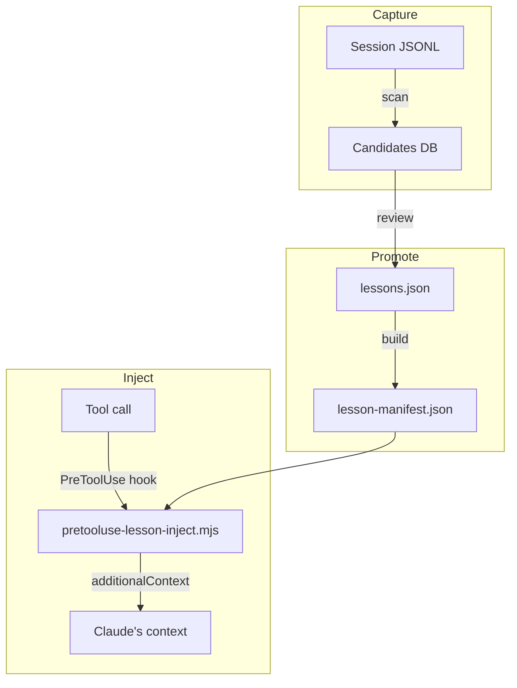
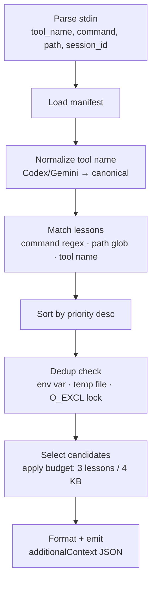

# Architecture

lessons-learned has three phases and a clear component boundary between each.

---

## Overview



---

## Component map

```
hooks/
  hooks.json                         Hook wiring (SessionStart, PreToolUse, SubagentStart)
  pretooluse-lesson-inject.mjs       Main injection pipeline (6 stages)
  session-start-lesson-protocol.mjs  Injects #lesson protocol + sessionStart lessons
  session-start-reset.mjs            Clears per-session dedup state on clear/compact
  session-start-scan.mjs             Fires background scan on startup (fire-and-forget)
  subagent-start-lesson-protocol.mjs Protocol injection for subagents
  lib/
    stdin.mjs          parsePayload() pure; parseHookInput() reads fd 0
    normalize-tool.mjs Maps Codex/Gemini tool names to canonical CC names
    dedup.mjs          3-layer dedup: env var, temp file, O_EXCL lock
    output.mjs         formatHookOutput() / formatEmptyOutput()

core/
  match.mjs            matchLessons(manifest, toolName, command, path) → LessonMatch[]
  select.mjs           selectCandidates(matches, budget, config) → LessonMatch[]

scripts/
  lessons.mjs          Single CLI entry point — all management subcommands
  scanner/
    structured.mjs     parseLessonTags(), scanLineForLessons()
    extractor.mjs      extractFromStructured(), extractFromHeuristic(), scoring
    detector.mjs       HeuristicDetector — stateful sliding-window
    incremental.mjs    Byte-offset state for incremental JSONL scanning

data/
  lessons.json          Source of truth — edit this
  lesson-manifest.json  Pre-compiled runtime manifest — regenerate with lessons build
  config.json           Injection and scanning configuration
```

---

## Phase 1: Capture

### Tier 1 — Structured tags

Claude emits `#lesson … #/lesson` tags in assistant responses when it recognizes a mistake. Example:

```
#lesson
tool: Bash
trigger: git stash
mistake: git stash only stashes tracked files — untracked files silently left behind
fix: Use git stash -u to include untracked files
tags: tool:git, severity:data-loss
#/lesson
```

The scanner greps for these tags in session JSONL files. Tags are embedded in assistant message lines as part of the response content — the scanner parses the JSONL envelope, extracts the `content` array from assistant messages, and runs `parseLessonTags()` on each text block.

### Tier 2 — Heuristic detection

`HeuristicDetector` (`scripts/scanner/detector.mjs`) maintains a sliding window over JSONL lines, looking for:

1. A tool result with error signals: non-zero `exit_code`, `Error:` prefix, `ECONNREFUSED`, etc.
2. An assistant response that follows within the window containing correction signals: `instead`, `should`, `fix`, `let me try`, etc.

When both match, the detector extracts:

- `mistake` from the error turn
- `remediation` from the correction turn
- `tool` and `trigger` from the preceding tool call
- `confidence` in the 0.4–0.6 range (lower fidelity)

Tier 2 candidates always have `needsReview: true`.

### Background scan

On session `startup`, `session-start-scan.mjs` fires and runs:

```js
const child = spawn(process.execPath, ['scripts/lessons.mjs', 'scan', '--auto'], {
  detached: true,
  stdio: 'ignore',
});
child.unref(); // parent exits immediately
```

The detached child:

1. Reads `data/scan-state.json` to find per-file byte offsets
2. Reads only new bytes since the last scan
3. Writes candidates to the database
4. Updates scan state with new offsets

`child.unref()` is essential — without it, the parent process stays alive waiting for the child, blocking the hook and delaying session startup.

---

## Phase 2: Promote

Candidates sit in the database until reviewed. The review surfaces them for human confirmation.

**Tier 1 auto-promotes** on interactive scan if the candidate passes intake validation:

- `mistake` and `fix` ≥ 20 chars
- No template placeholders (`<what_went_wrong>` etc.)
- `summary` doesn't end with `...`
- Trigger is not a prose gerund
- Jaccard similarity vs all existing lessons < 0.5

**Tier 2 requires human review** — the user supplies a summary, trigger pattern, and confirms the mistake is real and reusable.

After promotion, `lessons build` compiles `lessons.json` → `lesson-manifest.json`. The manifest is a pre-compiled, pre-indexed version of the store optimized for fast hook-time loading.

---

## Phase 3: Inject

The 6-stage pipeline in `pretooluse-lesson-inject.mjs`:



### Match

Three criteria, any of which can match a lesson:

- **`commandPatterns`** — regex tested against the `command` field of a `Bash` tool call
- **`pathPatterns`** — glob tested against `file_path` of `Read`/`Edit`/`Write`/`Glob` tool calls
- **`toolNames`** — exact match on the normalized tool name

Matching uses `core/match.mjs` — a pure function with no side effects. All regex objects are pre-compiled from `commandRegexSources` stored as `{ source, flags }` pairs in the manifest.

### Dedup

Three layers, fastest first:

1. **`LESSONS_SEEN` env var** — comma-separated slugs passed from the previous hook call, survives in-process
2. **Session temp file** — `TMPDIR/lessons-seen-{sessionId}` — survives subagent boundaries
3. **O_EXCL file lock** — `TMPDIR/lessons-claim-{sessionId}/{slug}` — prevents double-injection from parallel tool calls

Each lesson is injected at most once per session, regardless of how many tool calls match.

### Budget

Budget is applied after dedup, in priority order:

1. If full text fits remaining budget → inject full text
2. If only summary fits → inject `**Lesson**: {summary}` (fallback)
3. If nothing fits → drop for this call

The first lesson is always injected regardless of budget (prevents starvation when a very large lesson is the only match).

### Block

If a matched lesson has `block: true`, the pipeline short-circuits after match and emits a deny decision instead of `additionalContext`:

```json
{
  "hookSpecificOutput": {
    "hookEventName": "PreToolUse",
    "permissionDecision": "deny",
    "permissionDecisionReason": "pytest without --no-header hangs. Rerun as: pytest --no-header tests/"
  }
}
```

`{command}` in `blockReason` is substituted with the actual command at block time, truncated to 120 chars.

---

## Session start

Two hooks fire on `startup`:

1. **`session-start-reset.mjs`** — deletes `TMPDIR/lessons-seen-{sessionId}` and all O_EXCL claim files for the session. Starts the session with a clean dedup state.

2. **`session-start-lesson-protocol.mjs`** — emits two things as `additionalContext`:
   - The `#lesson` reporting protocol (so Claude knows how to emit lesson tags)
   - Any lessons with `sessionStart: true` (reasoning reminders with no command/path trigger)

On `clear` or `compact`, only the reset hook fires. After compaction, `compactionReinjectionThreshold` lessons have their dedup entries removed so they re-inject in the new context.

---

## Design decisions

### One manifest, not per-project files

All lessons — global and project-specific — live in a single `lessons.json` and compile to a single `lesson-manifest.json`. Per-project files would require the hook to discover and merge them at runtime, adding latency and complexity.

### No LLM in the pipeline

Candidate evaluation is fully deterministic: field length, placeholder detection, Jaccard similarity. This keeps the pipeline fast, offline-capable, and free of API costs.

### Fire-and-forget scan

The background scan spawns a detached child and unrefs it immediately. Session startup latency is not affected by scan duration, even on large session archives.

### 3-layer dedup

The dedup hierarchy handles three distinct failure modes:

- Env var: fast in-process check for sequential tool calls
- Temp file: handles subagents that run in separate processes but share the same session
- O_EXCL lock: prevents duplicate injection from parallel tool calls that race

### Pre-compiled manifest

The manifest stores `commandRegexSources` as `{ source, flags }` pairs instead of raw regex strings. This makes the manifest valid JSON (RegExp is not JSON-serializable) while allowing `new RegExp(source, flags)` reconstruction at match time without re-parsing.
