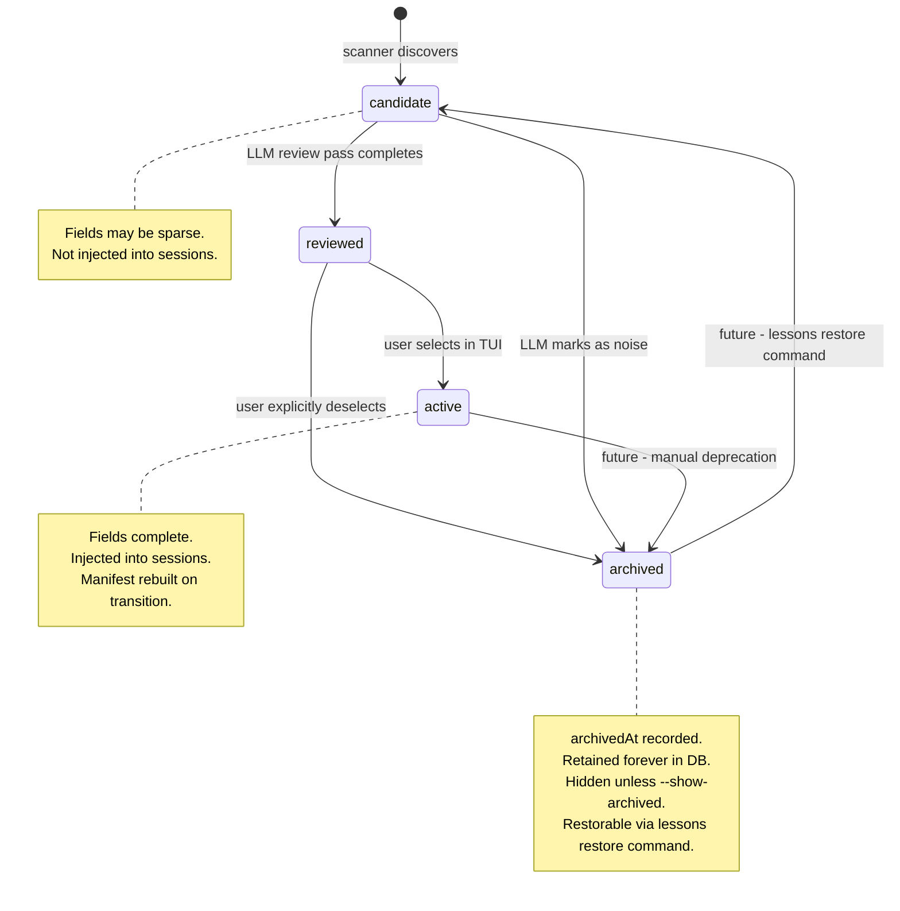
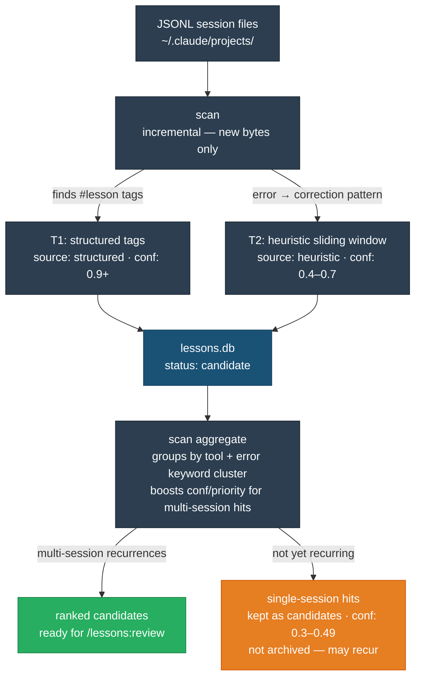
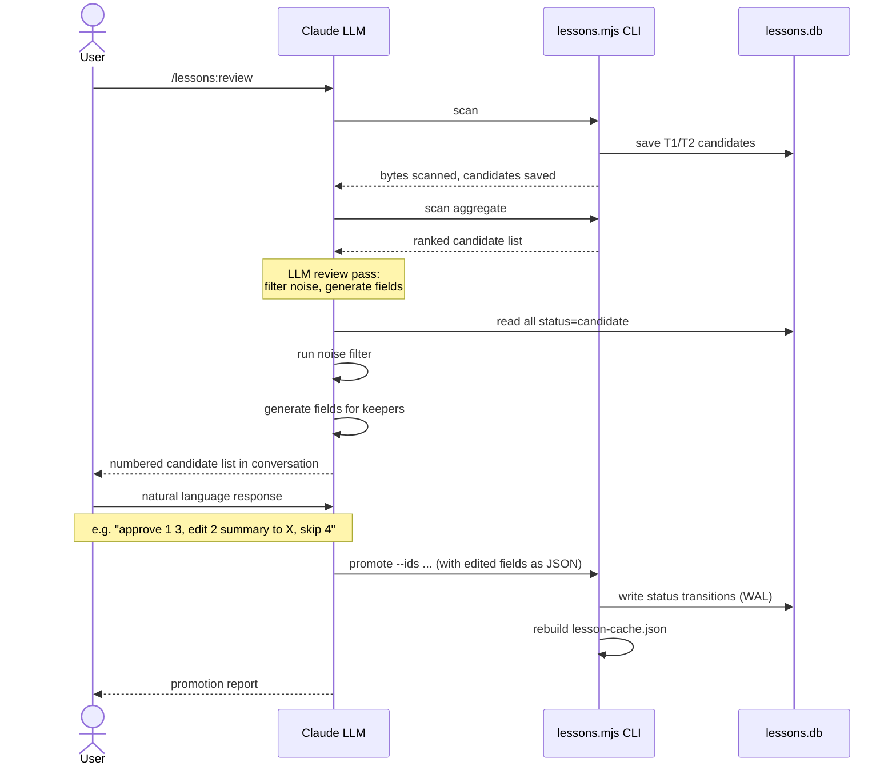
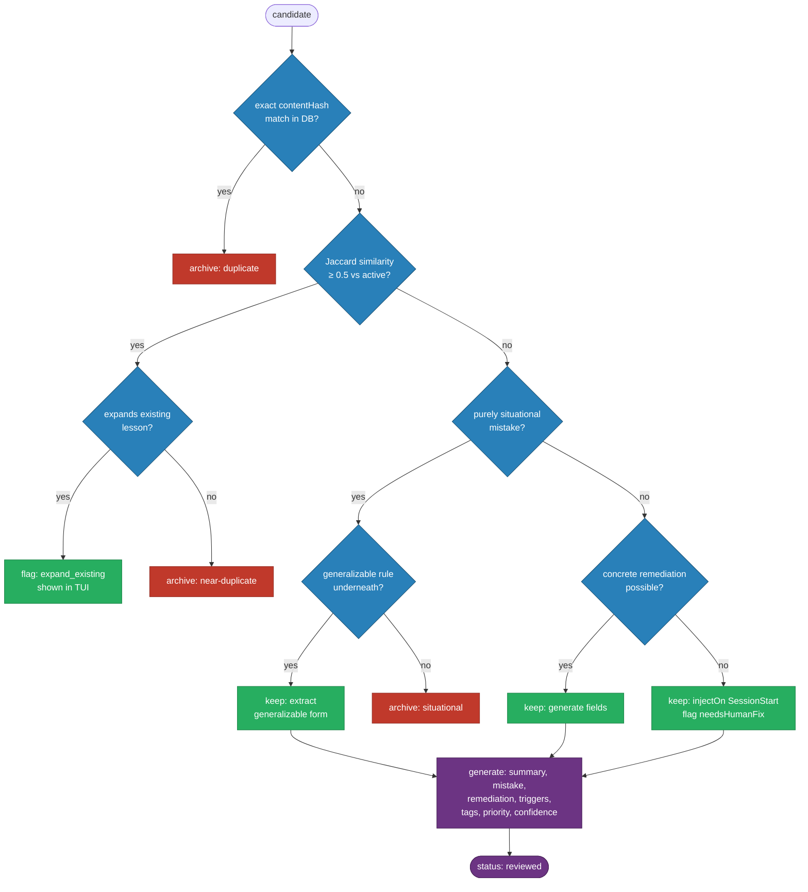

# PRD-002: `/lessons:review` — Unified Lesson Review Command

| Field            | Value                                        |
| ---------------- | -------------------------------------------- |
| **Status**       | Draft                                        |
| **Author**       | Joe Black                                    |
| **Created**      | 2026-04-02                                   |
| **Last Updated** | 2026-04-02                                   |
| **Stakeholders** | Individual developers using AI coding agents |

---

## 1. Problem Statement

The current lesson promotion pipeline requires multiple manual CLI invocations, each operating on separate JSON files with incompatible schemas:


`scan promote N` is the primary bottleneck — one interactive call per candidate, no LLM assistance. The orange files represent the same object at different lifecycle stages, each with its own schema.

**Current state:** Promoting 10 candidates requires 10 sequential `scan promote` calls, manual field editing, and a final `build`. The LLM — already present in the session — is not used.

**Desired state:** One command, `/lessons:review`, that uses the LLM to scan, aggregate, filter noise, and generate clean lesson fields, then hands off to an interactive terminal TUI for batch selection, inline editing, and promotion.

---

## 2. Goals

- Reduce lesson promotion from N calls to 1 command regardless of candidate count
- Use the LLM to filter noise and generate complete, well-formed lesson fields
- Give the user full control via an interactive TUI: batch select, inline edit, then confirm
- Unify the fragmented data files into a single SQLite DB with a proper state machine
- Preserve a permanent audit log of every review session

---

## 3. Non-Goals

- Editing existing active lessons (separate workflow)
- Surfacing archived lessons interactively (available via `--show-archived`, not default)
- Cross-agent sync or remote storage
- ML-based lesson ranking (priority remains human+LLM assigned)

---

## 4. Architecture Overview

The slash command is the entire interface — Claude's conversation context replaces a terminal TUI. No separate process, no stdin handoff, no terminal UI library required.

```text
/lessons:review (slash command — entirely within Claude's context)
  Phase 1: Scan          → node scripts/lessons.mjs scan
  Phase 2: Aggregate     → node scripts/lessons.mjs scan aggregate
  Phase 3: LLM review    → Claude reads candidates, filters, generates fields
  Phase 4: Present       → Claude displays numbered candidate list in conversation
  Phase 5: User responds → natural language ("approve 1 3, edit 2 summary to X, skip 4")
  Phase 6: Claude acts   → runs node scripts/lessons.mjs promote --ids ... to write DB
  Phase 7: Report        → Claude summarises what was promoted/archived/skipped
```

---

## 5. Data Layer — Unified SQLite DB

### 5.1 Why SQLite

Node 22.5+ ships `node:sqlite` as a **built-in module** — no npm dependency, no install step. The engine requirement moves from `>=18` to `>=22.5`. Hook scripts already shell out to Node, so they get the same runtime automatically.

SQLite provides:

- WAL mode for safe concurrent writes (eliminates lockfile hacks)
- `CREATE INDEX` for fast trigger-pattern lookups
- Full-text search via FTS5 virtual tables (future: semantic search over mistake/remediation)
- Embeddings via `sqlite-vec` extension (optional, for vector similarity dedup — see §5.4)

### 5.2 Schema (TypeScript)

```typescript
// Canonical record — stored in SQLite, same shape used everywhere
interface LessonRecord {
  // Identity
  id: string; // ULID — lexicographically sortable by creation time
  slug: string; // kebab-case, human-readable key

  // State machine
  status: 'candidate' | 'reviewed' | 'active' | 'archived';

  // Content
  summary: string; // ≤80 chars, present tense, specific
  mistake: string; // what goes wrong and why
  remediation: string; // concrete fix

  // Trigger spec
  // injectOn replaces the old sessionStart boolean — records which hook events fire this lesson.
  // Lessons with no natural trigger use ["SessionStart"] for awareness-only injection.
  injectOn: Array<'PreToolUse' | 'SessionStart' | 'SubagentStart'>;
  toolNames: string[]; // exact tool name match
  commandPatterns: string[]; // regex strings matched against Bash commands
  pathPatterns: string[]; // glob strings matched against file paths

  // Scoring
  priority: number; // 1–10; see rubric below
  confidence: number; // 0.0–1.0; see rubric below

  // Metadata
  tags: string[]; // namespaces: tool:X, lang:X, severity:X, topic:X
  // used for TUI filtering and injection context hints

  // Provenance
  source: 'structured' | 'heuristic' | 'manual';
  sourceSessionIds: string[];
  occurrenceCount: number;
  sessionCount: number;
  projectCount: number;

  // Audit trail
  createdAt: string; // ISO 8601
  updatedAt: string;
  reviewedAt: string | null; // set when status → "reviewed" or "active"
  archivedAt: string | null; // set when status → "archived"
  archiveReason: string | null;

  // Dedup
  contentHash: string; // SHA-256 of mistake+remediation+commandPatterns
}
```

**Priority rubric:**

| Priority | Meaning                                                      |
| -------- | ------------------------------------------------------------ |
| 9–10     | Blocks execution — data loss, hard hang, irreversible action |
| 7–8      | Silent failure or confusing behavior with no error signal    |
| 5–6      | Notable mistake, clear fix                                   |
| 3–4      | Minor friction, easy to notice and recover                   |
| 1–2      | Cosmetic / style                                             |

Frequency may nudge priority ±1 but is not the primary signal.

**Confidence rubric:**

| Confidence | Meaning                                                               |
| ---------- | --------------------------------------------------------------------- |
| 0.9–1.0    | Explicit `#lesson` tag emitted by Claude in a session (T1 structured) |
| 0.7–0.89   | T1 tag + confirmed by user correction or multi-project recurrence     |
| 0.5–0.69   | Heuristic detection (T2), multi-session                               |
| 0.3–0.49   | Heuristic, single-session or low signal                               |
| < 0.3      | Do not promote                                                        |

### 5.3 Indexes

```sql
CREATE INDEX idx_lessons_status ON lessons(status);
CREATE INDEX idx_lessons_priority ON lessons(priority DESC);
CREATE INDEX idx_lessons_confidence ON lessons(confidence DESC);
CREATE INDEX idx_lessons_status_priority ON lessons(status, priority DESC);
CREATE VIRTUAL TABLE lessons_fts USING fts5(summary, mistake, remediation, content=lessons);
```

### 5.4 Deduplication — MinHash

The current Jaccard tokenization approach produces false positives as the lesson store grows because it operates over the full token set rather than locality-sensitive buckets. MinHash generates a compact signature per lesson and enables accurate set-similarity estimation with sub-linear lookup — improving correctness, not just performance.

This is worth evaluating as a replacement for the current `computeContentHash` + full-scan approach at ~200+ lessons.

For SQLite, the `sqlite-vec` extension supports vector storage and can hold MinHash signatures. This is optional and deferred, but the schema is designed to accommodate it (nullable embeddings column).

### 5.5 Status state machine



`needsReview: bool` is removed — `status: "reviewed"` replaces it.

Key transitions:

- `candidate → reviewed` — LLM review pass completes (fields generated, not yet user-confirmed)
- `reviewed → active` — user selects in TUI and confirms
- `reviewed → archived` — user explicitly deselects (deliberate action, never automatic)
- `candidate → archived` — LLM marks as noise (duplicate, situational, etc.)
- `archived → candidate` — future `/lessons:restore` command

**Important:** Only records the user explicitly interacts with are written on any given session. Untouched candidates remain as `candidate` and reappear in the next review.

### 5.6 Migration

`scripts/migrate-db.mjs` (one-time):

1. Read `data/lessons.json` → insert as `status: "active"`
2. Read `data/filtered-candidates.json` → insert as `status: "candidate"`
3. Verify counts match source files
4. Rename originals to `.bak`

### 5.7 lesson-cache.json — kept as generated cache

With SQLite, hook scripts _could_ query the DB directly. However, hooks run on every Claude tool call and must be fast. The manifest is a pre-compiled cache: regexes already compiled, records filtered to `status: "active"`, injection budget config embedded. It is **regenerated** by `lessons.mjs build` whenever active records change.

Users never edit or read it directly — it is an implementation detail of the hook layer.

---

## 6. Phase 1 — Terminology Cleanup

| Old                             | New                        | Why                                                |
| ------------------------------- | -------------------------- | -------------------------------------------------- |
| `cross-project-candidates.json` | `filtered-candidates.json` | Already in-flight rename                           |
| `scan candidates`               | `scan aggregate`           | It aggregates heuristic windows across sessions    |
| `scan promote`                  | removed                    | Replaced by `/lessons:review`                      |
| `intake` (all occurrences)      | `review`                   | Matches command name; "intake" was internal jargon |

---

## 7. Phase 2 — Scan Pipeline



---

## 8. Phase 3 — `/lessons:review` Slash Command

**Location:** `.claude/commands/lessons/review.md`

### 8.1 End-to-end flow



### 8.2 LLM noise filter logic



Rules:

- Never discard solely because no trigger pattern can be written — use `injectOn: ["SessionStart"]`
- For near-duplicates: compare both; if candidate adds a new sub-case, flag `expand_existing`
- For vague error output: attempt to identify a generalizable rule before archiving

### 8.3 Review session file (audit log)

Written to `data/review-sessions/<ulid>.json`. Session IDs are ULIDs — lexicographically sortable by time. Kept permanently.

```json
{
  "sessionId": "01JXYZ...",
  "generatedAt": "2026-04-02T10:00:00Z",
  "candidatesConsidered": 8,
  "items": [
    {
      "action": "promote",
      "candidateId": "<id>",
      "lesson": { "summary": "...", "mistake": "...", "remediation": "..." }
    },
    {
      "action": "archive",
      "candidateId": "<id>",
      "archiveReason": "situational: specific file conflict, not generalizable"
    },
    {
      "action": "expand_existing",
      "candidateId": "<id>",
      "targetSlug": "git-stash-drops-untracked",
      "expansionNote": "adds sub-case: stash pop conflict when working tree dirty"
    }
  ]
}
```

---

## 9. Phase 4 — Conversational Review

The slash command presents candidates directly in the Claude conversation. No terminal TUI, no stdin, no external process. The LLM context is the interface.

### 9.1 Candidate presentation format

Claude presents reviewed candidates as a numbered list after the LLM review pass:

```text
Found 5 candidates. Archived 2 as noise. 3 ready for review:

1. git stash silently drops untracked files
   tool:git · severity:data-loss · priority:7 · conf:0.85
   Mistake:     git stash only stashes tracked files — untracked files silently left behind
   Remediation: Use git stash -u (--include-untracked)
   Trigger:     \bgit\s+stash\b(?!.*-u|--include-untracked)

2. ts-node requires --esm for ESM module resolution
   lang:ts · priority:5 · conf:0.72
   Mistake:     Running ts-node on an ESM project without --esm causes ERR_REQUIRE_ESM
   Remediation: Add --esm flag: ts-node --esm src/index.ts
   Trigger:     \bts-node\b(?!.*--esm)

3. jsx file must use .tsx extension  [expands: typescript-file-using-jsx]
   lang:ts · priority:5 · conf:0.68
   Mistake:     TypeScript files using JSX must have .tsx extension not .ts
   Remediation: Rename .ts → .tsx for any file containing JSX
   Trigger:     (none — SessionStart injection)

Archived by LLM:
  • [duplicate]    biome config schema — near-match of existing lesson
  • [situational]  git restore conflict — specific to bisect task, not generalizable

Reply with your decisions, e.g.:
  approve 1 2       — promote as-is
  skip 3            — leave as candidate for next session
  edit 2 summary "ts-node needs --esm for ESM projects"
  archive 1 "already know this"
  approve all
```

### 9.2 User response grammar

Claude accepts flexible natural language. Recognised patterns:

| Intent                         | Example                                                |
| ------------------------------ | ------------------------------------------------------ |
| Approve one or more            | `approve 1 3`, `approve all`                           |
| Skip (keep as candidate)       | `skip 2`, `skip all`                                   |
| Archive with reason            | `archive 3 "too niche"`                                |
| Edit a field then approve      | `edit 1 summary "X" then approve`, `edit 2 priority 8` |
| Unarchive an LLM-archived item | `unarchive biome-config`                               |
| Ask to see full details        | `show 2`                                               |

After parsing the response, Claude confirms its interpretation before writing to the DB:

```text
Got it. About to:
  ✓ Promote: git-stash-drops-untracked, ts-node-esm-flag
  ↷ Skip:    jsx-tsx-extension (will reappear next session)

Confirm? [y/n]
```

### 9.3 Promotion

On confirmation, Claude runs:

```bash
node scripts/lessons.mjs promote --ids <id1>,<id2> [--patch '{"id": {...fields}}']
```

The `promote` subcommand accepts a list of IDs (and optional field patches for edits) and writes the DB transitions atomically via SQLite WAL:

- **Promoted IDs** → `UPDATE status='active', reviewedAt=now()`
- **Archived IDs** → `UPDATE status='archived', archivedAt=now(), archiveReason=...`
- **Skipped IDs** → no write; remain `status='candidate'`

Then rebuilds `lesson-cache.json` and reports:

```text
✓ Added: git-stash-drops-untracked   (tool:git, priority:7)
✓ Added: ts-node-esm-flag            (lang:ts,  priority:5)
↷ Skipped: jsx-tsx-extension (will reappear next session)
lesson-cache.json rebuilt. 2 new lessons active.
```

---

## 10. No External Dependencies

The conversational review approach eliminates all UI-related dependencies:

- No `ink` / `react`
- No `esbuild` build step
- No bundled binary to commit and maintain
- No stdin / terminal handoff problem

The only runtime requirement is Node.js ≥ 22.5 (for `node:sqlite`), which is already required for the DB layer.

---

## 11. Files to Create / Modify

| File                                 | Action           | Purpose                                                                                |
| ------------------------------------ | ---------------- | -------------------------------------------------------------------------------------- |
| `data/lessons.db`                    | Create (migrate) | SQLite DB replacing lessons.json + filtered-candidates.json                            |
| `data/review-sessions/`              | Create dir       | Permanent ULID-named audit logs                                                        |
| `scripts/migrate-db.mjs`             | Create           | One-time migration from JSON files to SQLite                                           |
| `.claude/commands/lessons/review.md` | Create           | Slash command                                                                          |
| `scripts/lessons.mjs`                | Modify           | Add `promote` subcommand; rename `scan candidates` → `scan aggregate`; update DB paths |
| `scripts/scanner/*.mjs`              | Modify           | Write candidates to SQLite instead of filtered-candidates.json                         |
| `package.json`                       | Modify           | Bump `engines.node >= 22.5`                                                            |

`lesson-cache.json` remains as a generated-only build artifact — the compiled output of `lessons build`, consumed by hook scripts for fast regex matching. Not a source-of-truth; regenerated on every promotion.

---

## 13. Verification

1. `scripts/migrate-db.mjs` — DB has 30 active + 15 candidate records; `.bak` files present
2. `/lessons:review` — scan runs, aggregate runs, LLM review writes `data/review-sessions/<ulid>.json`
3. TUI opens — arrow keys navigate, space toggles, `→` opens split-pane editor
4. Edit a field inline — change persists when switching rows
5. Confirm promotion — selected records show `status: 'active'` in DB; manifest rebuilt
6. Untouched candidates — verify they remain `status: 'candidate'` in DB
7. Re-run `/lessons:review` — untouched candidates reappear; promoted records absent
8. Archived row `→` — LLM reason visible; [Unarchive] action works
9. Empty state — "No candidates found. Run `lessons scan` to discover new ones."
