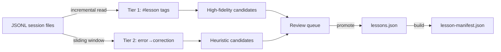

# Scanning & Discovery

The scanner automatically discovers lessons from your session history. It runs in the background on every session startup and writes candidates to the database for your review.

---

## How scanning works

Claude Code writes every session to a JSONL file in `~/.claude/projects/`. Each line is a JSON object — a user message, an assistant response, a tool call, or a tool result.

The scanner reads these files and looks for two things:

- **Tier 1:** Structured `#lesson` tags that Claude emitted when it recognized a mistake
- **Tier 2:** Error→correction sequences — a tool result that looks like a failure, followed by a corrected assistant response



---

## Background scan

On every session `startup`, `session-start-scan.mjs` fires and spawns `lessons.mjs scan --auto` as a detached background process. The parent process unrefs the child immediately so session startup is not delayed.

The scan:

1. Reads saved byte offsets from `data/scan-state.json` to resume where it left off
2. Processes only new bytes in each JSONL file (incremental)
3. Writes new candidates to the database with `status='candidate'`
4. Updates `data/scan-state.json` with new offsets

The background scan respects `autoScanIntervalHours` — if the last scan was recent, it exits early.

### Running a scan manually

```bash
node scripts/lessons.mjs scan              # incremental scan, interactive
node scripts/lessons.mjs scan --auto       # non-interactive (background mode)
node scripts/lessons.mjs scan --full       # reset offsets, re-scan everything
node scripts/lessons.mjs scan --dry-run    # show what would be found, don't write
```

---

## Tier 1 — Structured tags

When Claude makes and corrects a mistake during a session, it emits a `#lesson` tag:

```
#lesson
tool: Bash
trigger: git stash
problem: git stash only stashes tracked files — untracked files silently left behind
solution: Use `git stash -u` to include untracked files
tags: tool:git, severity:data-loss
#/lesson
```

The scanner greps for `#lesson` markers in assistant message lines, parses the block, and extracts a structured candidate with:

- `tool`, `trigger`, `problem`, `solution`, `tags` from the tag
- `confidence` scored based on how many optional fields are present
- `sessionId` and `messageId` for provenance

**Tier 1 candidates auto-promote** during interactive scan if they pass validation:

- `problem` and `solution` each ≥ 20 chars
- No template placeholders
- Jaccard similarity vs existing lessons < 0.5

If they fail validation, they appear in the review queue for manual adjustment.

---

## Tier 2 — Heuristic detection

For sessions where Claude didn't emit `#lesson` tags, the heuristic detector applies a sliding window over the JSONL stream looking for:

1. A **tool result** that contains error signals (non-zero exit, `Error:`, `ECONNREFUSED`, etc.)
2. An **assistant response** that follows with a correction (contains `instead`, `should`, `fix`, `use`, etc.)

When both conditions match within a configurable window, the detector extracts a candidate with:

- `problem` derived from the error message
- `solution` derived from the correction
- `confidence` in the 0.4–0.6 range (lower than Tier 1)
- `needsReview: true` — always requires human confirmation

**Tier 2 candidates always require manual review** before promotion. They're noisier and need a summary, trigger pattern, and confirmation that the mistake is real and reusable.

---

## Viewing candidates

```bash
node scripts/lessons.mjs scan candidates   # cross-project recurring patterns
node scripts/lessons.mjs list --status candidate  # all candidates
```

Or from Claude Code:

```
/lessons:manage → "show pending candidates"
/lessons:review
```

`scan candidates` surfaces only patterns that appear in **2+ sessions**, which filters out single-occurrence noise.

---

## Promoting candidates

### Tier 1 candidates

Auto-promoted on interactive scan if they pass validation. Claude shows you a preview and you confirm or skip:

```bash
node scripts/lessons.mjs scan
```

### Tier 2 candidates

Require manual review. Use `scan promote` with the candidate index:

```bash
node scripts/lessons.mjs scan candidates   # list with index numbers
node scripts/lessons.mjs scan promote 3    # promote candidate #3
```

During promotion, you'll be prompted for:

- Summary (if not auto-derived)
- Trigger pattern (command regex or glob)
- Priority and tags

After promotion, the manifest is rebuilt automatically.

### Interactive review

The `/lessons:review` slash command walks through all pending candidates with guided prompts. It's the recommended way to review a batch of candidates.

---

## Scan state

The scanner tracks progress in `data/scan-state.json`:

```json
{
  "files": {
    "/Users/alice/.claude/projects/abc123.jsonl": 184320
  },
  "lastFullScanAt": "2026-04-01T00:00:00Z"
}
```

Each file entry is the last byte offset read. The next scan resumes from that point, processing only new content. This makes incremental scans fast even on large session archives.

`scan-state.json` is managed by the scanner — don't edit it directly. To force a full re-scan:

```bash
node scripts/lessons.mjs scan --full
```

---

## Configuring scan paths

By default, the scanner reads `~/.claude/projects/`. If your session files are elsewhere:

```json
{
  "scanPaths": ["~/.claude/projects/", "/path/to/other/agent/sessions/"]
}
```

Edit `data/config.json` to add directories. Tilde expansion is supported.

---

## Scan frequency

The `autoScanIntervalHours` setting (default: `24`) prevents the background scan from running on every session startup. A manual scan always runs regardless of this setting.

To scan on every startup:

```json
{
  "autoScanIntervalHours": 0
}
```

To scan weekly:

```json
{
  "autoScanIntervalHours": 168
}
```
