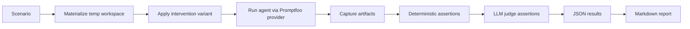

# PRD-003: `lessons-learned` Eval Framework

| Field            | Value                                        |
| ---------------- | -------------------------------------------- |
| **Status**       | Draft                                        |
| **Author**       | Joe Black                                    |
| **Created**      | 2026-04-11                                   |
| **Last Updated** | 2026-04-11                                   |
| **Stakeholders** | Individual developers using AI coding agents |

---

## 1. Problem Statement

`lessons-learned` can capture, store, and inject lessons, but it currently lacks a reliable way to answer the most important product question:

> Does a given lesson or group of lessons actually improve agent behavior?

The current test suite validates runtime contracts and deterministic hook logic:

- unit tests for matching, selection, parsing, and scanning
- integration tests for CLI and hook pipelines
- E2E tests for cross-agent protocol normalization

This is necessary, but it is not sufficient.

It does **not** tell us:

- whether a lesson improves task completion
- whether a lesson prevents a known-bad tool action
- whether changing lesson wording helps or hurts
- whether a new lesson regresses existing behavior
- whether lesson groups outperform individual lessons
- whether the same framework can later evaluate skills and plugins

**Current state:** lesson quality is inferred from intuition, manual observation, and static validation.

**Desired state:** a local-first eval system that runs realistic agent tasks automatically, captures run artifacts, scores outcomes with deterministic checks plus LLM judges, and stores results as structured JSON and Markdown reports.

---

## 2. Goals

1. Build a **fully automated local eval pipeline** for lesson effectiveness
2. Compare **baseline vs. treatment** for individual lessons and lesson groups
3. Capture **structured run artifacts** for each eval execution
4. Use **deterministic checks first** and **LLM-as-judge second**
5. Produce **JSON results** and **Markdown reports**
6. Reuse open-source frameworks for at least **80%** of the implementation
7. Keep the system **CI-compatible** even if CI integration ships later
8. Design the framework so it can later evaluate **skills** and **plugins**

---

## 3. Non-Goals

1. Replacing the current deterministic runtime hook path with an eval framework
2. Building a hosted experiment platform in V1
3. Supporting audio/video transcription workflows
4. Solving online production observability in V1
5. Building a generalized benchmark suite for all coding agents independent of this repo
6. Guaranteeing fully model-agnostic support on day one for every hosted provider

---

## 4. Product Principles

### 4.1 Find, not build

The framework should adopt an existing eval runner and only build repo-specific glue.

### 4.2 Local-first

The primary workflow is a developer running evals on their machine against a local checkout.

### 4.3 Deterministic before subjective

A hidden test, forbidden-command check, or trace assertion is more reliable than an LLM judge. LLM grading fills the gaps rather than owning the entire score.

### 4.4 Behavioral evidence over final-text evidence

Many lesson failures are about **agent trajectory**, not just final prose. The framework must capture workflow evidence, not only the assistant's final answer.

### 4.5 Reuse real runtime hooks

The eval environment should use the same lesson hooks and lesson artifacts as normal repo usage whenever feasible.

---

## 5. Proposed Solution

Build a repo-local eval system powered by **Promptfoo**, using **Vercel `next-evals-oss`** as the structural reference pattern.

### Core stack

- **Runner**: Promptfoo
- **Scenario packaging pattern**: Vercel `next-evals-oss`
- **Behavior-verification reference**: `superpowers` transcript-based skill tests
- **Judge strategy**: Promptfoo model-graded assertions plus custom JS assertions
- **Result formats**: Promptfoo JSON + repo-rendered Markdown reports

### Why this stack

- Promptfoo already supports local CLI execution, result export, CI workflows, model graders, custom assertions, and multiple providers
- Promptfoo already supports the **Claude Agent SDK** and **OpenAI Codex SDK**
- The repo is already Node-first, so Promptfoo fits the existing runtime better than a Python-first eval framework
- `next-evals-oss` demonstrates a good coding-task eval shape: self-contained scenario folders, hidden assertions, rerun memoization, and clean result export

---

## 6. User Stories

### US-1: Evaluate a single lesson

> As a maintainer, I want to test one lesson against a fixed task so that I can tell whether the lesson improves behavior relative to no lesson.

**Acceptance Criteria**:

- For a brand-new lesson, run a scenario in `no lessons` and `candidate lesson` modes
- Persist structured results for both
- Produce a delta summary showing whether the lesson helped, hurt, or had no effect

### US-1b: Evaluate a lesson revision

> As a maintainer, I want revised lesson text compared against the previous accepted lesson text so that I can measure whether the edit is actually an improvement.

**Acceptance Criteria**:

- For an existing lesson revision, compare `new lesson text` against `previous lesson text`
- Reuse cached results for the previous version when the execution fingerprint is unchanged
- Report whether the revision improved or regressed outcomes

### US-2: Evaluate a group of lessons

> As a maintainer, I want to test a lesson bundle so that I can validate whether a curated set improves behavior without over-injecting noise.

**Acceptance Criteria**:

- Support selecting multiple lessons by slug or tag
- Compare group performance against baseline and current active lessons
- Report aggregate and per-scenario deltas

### US-3: Validate runtime behavior, not just final text

> As a maintainer, I want to know whether the lesson was actually injected and whether the agent changed its tool behavior, so that scores reflect mechanism as well as outcome.

**Acceptance Criteria**:

- Capture hook and trajectory artifacts
- Assert whether lesson injection occurred
- Assert whether a known-bad command or edit path was avoided

### US-4: Generate structured artifacts

> As a maintainer, I want eval runs stored in JSON and summarized in Markdown so that I can inspect details locally and later wire them into CI or docs.

**Acceptance Criteria**:

- Emit machine-readable JSON for every run
- Emit a Markdown summary with scenario outcomes, score deltas, and regressions

### US-5: Extend the same framework to skills and plugins later

> As a maintainer, I want the eval framework designed around generic agent interventions rather than only lessons, so that future skill/plugin evals reuse the same system.

**Acceptance Criteria**:

- Scenario schema is intervention-agnostic
- Result schema does not assume lessons are the only treatment type
- Providers and assertions can be reused for skills/plugins

---

## 7. Architecture Overview

```text
evals/
├── scenarios/
│   ├── lesson-001-block-bare-pytest/
│   │   ├── PROMPT.md
│   │   ├── scenario.json
│   │   ├── seed-workspace/
│   │   ├── hidden-checks/
│   │   │   └── verify.mjs
│   │   └── rubric.md
│   └── ...
├── providers/
│   ├── claude-agent.mjs
│   ├── codex-agent.mjs
│   └── openai-compatible.mjs
├── scripts/
│   ├── materialize-workspace.mjs
│   ├── collect-run-artifacts.mjs
│   └── render-report.mjs
├── results/
│   ├── <run-id>.json
│   └── <run-id>.md
└── promptfooconfig.yaml
```

### Run flow



---

## 8. Intervention Model

The framework should treat "lesson" as one intervention type among several.

### V1 intervention types

- `none` — baseline, no lesson injected
- `lesson` — single lesson by slug
- `lesson-group` — explicit list of lesson slugs

### Future intervention types

- `skill`
- `skill-group`
- `plugin`
- `config-change`

This preserves the ability to evaluate future repo capabilities without replacing the framework.

### 8.1 Comparison semantics

Interventions are compared differently depending on whether the lesson is new or revised.

For a brand-new lesson:

- control = `none`
- treatment = `lesson`

For a revised existing lesson:

- control = `previous lesson text`
- treatment = `new lesson text`

This avoids conflating two separate questions:

1. does any lesson beat no lesson?
2. does the latest wording beat the previous wording?

---

## 9. Lesson-Type Evaluation Model

The eval framework must account for the repo's lesson type taxonomy:

- `hint`
- `guard`
- `protocol`
- `directive`

These are not just storage labels. They imply different success conditions.

### 9.1 Core rule

Every scenario must score:

1. **mechanism** — did the lesson produce the intended intermediate behavior?
2. **outcome** — did that behavior improve the final task result versus control?

Mechanism-only success does not count as a passing eval.

### 9.2 Type-specific expectations

| Type | Mechanism expectation | Outcome expectation |
| ---- | --------------------- | ------------------- |
| `hint` | Matching context was injected and the unsafe path was avoided | Task completes with a better or safer result than control |
| `guard` | Unsafe command was denied and the agent pivoted | Task still completes correctly via a safer alternative |
| `protocol` | Session-start reasoning reminder changes how the agent approaches the task | Final result is higher quality, more correct, or more robust than control |
| `directive` | Standing principle changes workflow at startup and at relevant matched moments | Final result is higher quality and the workflow is measurably better than control |

### 9.3 Automatic-fail gates

Some lessons make a hard claim about required intermediate behavior. Those scenarios need explicit gates.

Example: a directive or protocol that says the agent must ask clarifying questions before planning.

That scenario should fail automatically if:

- the agent begins planning before asking clarifying questions
- the agent begins implementation before asking clarifying questions

But asking questions alone is still not sufficient. The eval must also compare the downstream result against control:

- is the resulting project working?
- is it higher quality?
- are tests better?
- did the clarification actually improve the outcome?

### 9.4 Seed examples for V1 scenarios

The first scenario set should be sourced from representative lessons such as:

- `hint`: shared git worktree corruption, shell `eval` injection, hardcoded secrets
- `guard`: bare `pytest` hang in non-interactive terminals
- `protocol`: missing Bash availability assumptions, wrong hook schema, overfitted fixes
- `directive`: speculative abstraction, implementing before requirements are clear, asking questions before planning

---

## 10. Scenario Model

Each scenario is a coding task designed to expose a lesson-sensitive behavior.

### 10.1 Required scenario fields

```json
{
  "id": "lesson-001-block-bare-pytest",
  "title": "Prevent bare pytest invocation",
  "category": "pretooluse",
  "difficulty": "small",
  "promptFile": "PROMPT.md",
  "workspaceSeedDir": "seed-workspace",
  "verifyScript": "hidden-checks/verify.mjs",
  "rubricFile": "rubric.md",
  "recommendedInterventions": [
    "pytest-no-header-timeout-abcd"
  ]
}
```

### 10.2 Scenario categories

- `session-start`
- `pretooluse`
- `subagent-start`
- `compact`
- `future-skill`
- `future-plugin`

---

## 11. Artifact Model

For this project, "transcript generation" means standardized collection of run artifacts.

### 11.1 Minimum artifact set

- scenario ID
- intervention ID or type
- comparison target metadata
- model/provider metadata
- prompt sent to the agent
- final assistant output
- hook events
- tool calls / trajectory evidence
- workspace diff summary
- hidden-check outputs
- assertion results
- judge scores
- duration / token / cost metadata when available

### 11.2 Result record

```typescript
interface EvalRunResult {
  runId: string;
  scenarioId: string;
  intervention: {
    type: 'none' | 'current-lessons' | 'lesson' | 'lesson-group';
    ids: string[];
    contentHash?: string;
  };
  comparison: {
    mode: 'candidate-vs-none' | 'revision-vs-previous';
    controlRunId?: string;
    controlContentHash?: string;
  };
  provider: {
    id: string;
    model: string;
  };
  artifacts: {
    finalOutput: string;
    hookEvents: unknown[];
    trajectory: unknown[];
    hiddenCheck: {
      pass: boolean;
      details: unknown;
    };
  };
  scores: {
    mechanismPass: number;
    taskSuccess: number;
    blockedBadAction: number;
    expectedStrategy: number;
    questionBeforePlanning: number;
    diffQuality: number;
    explanationQuality: number;
    overall: number;
  };
  metadata: {
    durationMs: number;
    tokens?: {
      input: number;
      output: number;
    };
    costUsd?: number;
  };
}
```

### 11.3 Run cache key

Completed runs should be cached and reused when the execution fingerprint is unchanged.

Suggested cache key dimensions:

- scenario ID
- lesson type
- intervention type
- intervention content hash
- provider
- model
- workspace seed version
- hidden-check version
- eval config version

The framework should reuse cached control runs instead of re-executing them whenever possible.

---

## 12. Scoring Design

### 12.1 Tier 1: deterministic checks

These should be the foundation of the score.

Examples:

- hidden tests pass
- required files exist
- forbidden files do not exist
- forbidden commands were not used
- expected commands were used
- lesson injection event occurred
- expected hook path occurred

### 12.2 Tier 2: trajectory checks

These score behavior that is visible in tool-use traces.

Examples:

- command sequence avoided a known-bad path
- agent switched strategy after injection
- subagent inherited lesson protocol
- compact/clear reinjection happened

### 12.3 Tier 3: LLM judge checks

These score what deterministic checks cannot measure well.

Examples:

- quality of remediation explanation
- completeness of fix when multiple good diffs are possible
- appropriateness of strategy choice

### 12.4 Type-specific hard gates

Hard gates should zero or fail the scenario before weighted aggregation when violated.

Examples:

- `guard`: guarded command executed despite the lesson
- `protocol`: required startup reasoning behavior absent
- `directive`: required question-asking or collaboration behavior absent before planning
- `hint`: known unsafe path taken despite an applicable hint

For the "ask questions before planning" lesson specifically:

- no clarifying questions before planning is an automatic fail
- no clarifying questions before implementation is an automatic fail
- even after passing the gate, the treatment still must outperform control on project quality

### 12.5 Overall weighting

Initial weighting:

- deterministic: 60%
- trajectory: 25%
- LLM judge: 15%

These weights can change once real scenario data exists.

### 12.6 Scoring against control

Scores should always be interpreted relative to an explicit control:

- new lesson: compare against `none`
- revised lesson: compare against `previous lesson text`

The Markdown report should show both raw scores and deltas versus control.

---

## 13. Provider Strategy

### V1 providers

- **Claude Agent SDK provider**
- **OpenAI Codex SDK provider**

### Future providers

- OpenAI-compatible hosted wrapper
- Anthropic hosted wrapper
- z.ai wrapper
- Kimi K2 wrapper

### Provider requirements

- explicit working directory
- temp workspace isolation
- non-interactive execution
- structured artifact capture
- stable configuration under automation

---

## 14. Why Promptfoo Is the Primary Framework

Promptfoo is the right V1 choice because it already supplies:

- local CLI execution
- custom providers and assertions
- model-graded assertions
- JSON and HTML outputs
- side-by-side model comparisons
- CI integration path

This means the project only needs to build:

- scenario materialization
- lesson intervention wiring
- hidden check scripts
- repo-specific Markdown rendering

Everything else would be wasteful reinvention.

---

## 15. Why Other Frameworks Are Not Primary in V1

### Inspect AI

Strong future option, but too heavy for the shortest path because it is Python-first and the repo is Node-first.

### Braintrust

Attractive once hosted experiment management matters, but unnecessary early platform overhead for a local-first build.

### Langfuse

Better later for observability and experiment history than as the initial runner.

### DeepEval

Useful metrics library, but not the cleanest fit for external CLI coding agents in this repo.

### Anthropic / OpenAI eval tooling

Useful for methodology and rubric design, but not the most efficient OSS local runner choice here.

---

## 16. Initial Scope

### Scenario count

Start with **6-10 scenarios**:

- 3 `pretooluse`
- 2 `session-start`
- 2 `subagent-start`
- 1 `compact`

The initial set should include at least:

- one `guard` scenario
- one `hint` security/safety scenario
- one `protocol` reasoning scenario
- one `directive` collaboration-before-planning scenario

### Supported experiment modes

- candidate-vs-none
- revision-vs-previous
- lesson-group-vs-none
- lesson-group-vs-previous-group

### Supported outputs

- JSON result file
- Markdown summary file
- persistent cache entries for reusable runs

### Supported entry points

```bash
npm run eval
npm run eval:smoke
npm run eval -- --scenario <id>
npm run eval -- --lesson <slug>
npm run eval -- --agent claude
npm run eval -- --agent codex
npm run eval:report -- --input evals/results/<run-id>.json
```

---

## 17. Phased Delivery Plan

### Phase 1: Skeleton

- add `evals/` subproject
- add Promptfoo config
- add Claude and Codex providers
- add temp workspace materializer
- add JSON-to-Markdown report renderer
- add run-cache keying and result lookup

### Phase 2: First real scenarios

- implement 6-10 initial scenarios
- add deterministic hidden checks
- validate baseline vs treatment runs
- validate cache reuse for unchanged control runs

### Phase 3: Intervention management

- support single lesson and lesson-group selection
- add consistent result IDs and metadata
- add run comparison summaries
- support `candidate-vs-none` and `revision-vs-previous`

### Phase 4: Polish

- improve report readability
- add smoke suite
- make local run ergonomics stable

### Phase 5: CI readiness

- add one non-interactive CI command
- define pass/fail thresholds
- run a reduced suite in PRs, full suite on schedule or manual trigger

---

## 18. Success Metrics

### Product-level success

- Maintainer can answer whether a lesson improved outcomes with evidence, not intuition
- New lesson changes can be compared against baseline in one command
- Regressions are visible in structured reports
- Reports clearly separate mechanism failures from outcome failures

### Engineering success

- V1 implementation mostly reuses an OSS runner
- Repo-specific glue remains narrow and understandable
- Adding a new scenario takes minutes, not hours
- Editing a lesson does not force every prior control run to be repeated

### Operational success

- Default local run is easy to execute
- Results are inspectable after the fact
- Future CI integration does not require redesign

---

## 19. Risks and Mitigations

### Risk: LLM judge noise overwhelms useful signal

**Mitigation:** weight deterministic and trajectory checks more heavily than judge scores.

### Risk: Synthetic tasks fail to represent real lesson value

**Mitigation:** derive early scenarios from real lessons and real observed failure modes.

### Risk: The framework rewards performative compliance

Example: the agent asks one shallow question, then produces the same bad plan.

**Mitigation:** require both hard-gated mechanism checks and downstream quality deltas versus control.

### Risk: Promptfoo integration does not expose enough hook evidence

**Mitigation:** capture repo-local artifacts explicitly via helper scripts and transcript parsing where needed.

### Risk: Framework glue grows too large

**Mitigation:** aggressively prefer Promptfoo-native features and keep custom code limited to workspace setup, assertions, and reporting.

### Risk: Cache invalidation errors produce stale comparisons

**Mitigation:** use explicit content hashes and versioned execution fingerprints for scenarios, workspaces, checks, and config.

### Risk: Provider support diverges across agent ecosystems

**Mitigation:** keep scenario and result schemas provider-agnostic; isolate provider-specific behavior under `evals/providers/`.

---

## 20. Open Questions

1. Should lesson-group evals support tag-based selection in V1 or wait until V2?
2. How much real hook configuration should the eval workspace inherit versus override?
3. Should "current active lessons" mean the current manifest only, or the store plus experimental overlay?
4. Do we want a canonical run schema checked by JSON Schema from day one?
5. Should CI run only smoke scenarios, or a small representative slice per category?
6. When skills and plugins are added later, should they share one `intervention` namespace or remain separate top-level types?
7. Should lesson-group revisions compare against the last accepted group definition by exact content hash or by a named group identity?

---

## 21. Decision

Build V1 of the eval framework with:

- Promptfoo as the runner
- Vercel `next-evals-oss` as the packaging reference
- deterministic hidden checks first
- trajectory and transcript evidence second
- LLM judges third
- JSON + Markdown outputs from the first iteration

This is the fastest credible path to production-style eval infrastructure for `lessons-learned` without overbuilding.
