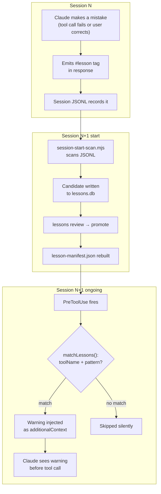
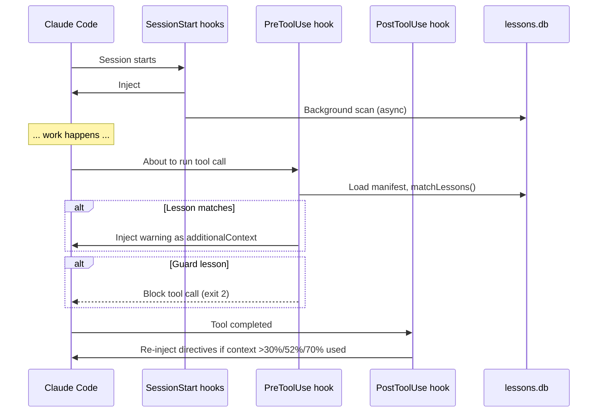
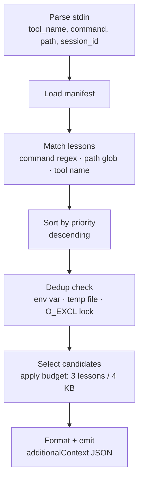

# How It Works

lessons-learned has three phases: **capture**, **promote**, and **inject**. Understanding each phase makes everything else make sense.

---

## The capture → inject loop



---

## Hook sequence



---

## Phase 1: Capture

### Tier 1 — Structured tags

When Claude makes a mistake and corrects it, it emits a `#lesson` tag in its response:

```text
#lesson
tool: Bash
trigger: git stash
problem: git stash only stashes tracked files — untracked files silently left behind
solution: Use `git stash -u` to include untracked files
tags: tool:git, severity:data-loss
#/lesson
```

These tags are embedded in the session JSONL files that Claude Code writes to `~/.claude/projects/`. The scanner greps for them on the next session startup.

### Tier 2 — Heuristic detection

For sessions where Claude didn't emit structured tags, the heuristic detector scans for error→correction sequences: a tool result that looks like an error, followed by a corrected assistant response. These are lower-fidelity — they require manual review before promotion.

### Background scan

On every session `startup` event, `session-start-scan.mjs` fires a detached background process that runs `lessons.mjs scan --auto`. This process:

1. Reads byte offsets from `data/scan-state.json` to resume where it left off
2. Processes only new bytes in each JSONL file
3. Writes new candidates to the DB with `status='candidate'`

The parent process unrefs the child immediately, so session startup is not delayed.

---

## Phase 2: Promote

Candidates sit in the DB with `status='candidate'` until you review them.

**Tier 1 candidates** (from `#lesson` tags) pass intake validation automatically — if they meet the quality bar (no duplicates, no short fields, no placeholder text), they're ready to promote immediately.

**Tier 2 candidates** (heuristic) always require human review. They're noisier and need a summary, trigger pattern, and confirmation that the mistake is real and reusable.

Use `/lessons:review` for the guided pipeline, or `lessons:manage` to browse and act on specific items.

After promotion, run:

```bash
node scripts/lessons.mjs build
```

This compiles the store into `lesson-manifest.json` — the pre-compiled runtime index the hook reads.

---

## Phase 3: Inject

Before every `Bash`, `Read`, `Edit`, `Write`, or `Glob` call, `pretooluse-lesson-inject.mjs` runs a 6-stage pipeline:



**Match** — three criteria, any of which can match:

- `commandPatterns` — regex tested against the Bash command string
- `pathPatterns` — glob tested against `Read`/`Edit`/`Write` file paths
- `toolNames` — exact match on the tool name

**Dedup** — three layers, fastest first:

1. `LESSONS_SEEN` env var (in-process, survives the hook call)
2. A session temp file (survives subagent boundaries)
3. An `O_EXCL` file lock per slug (prevents double-injection from parallel tool calls)

Each lesson is injected at most once per session, regardless of how many tool calls trigger it.

**Budget** — at most 3 lessons and 4 KB of text per call. If a lesson's full text doesn't fit the remaining budget, the hook falls back to injecting just the one-line summary. If even the summary doesn't fit, the lesson is dropped for this call.

**Blocking** — if a lesson has `type: "guard"`, the hook emits a `permissionDecision: "deny"` response instead of `additionalContext`, preventing the tool call entirely.

---

## Session start

On `startup`, two hooks fire:

1. **`session-start-reset.mjs`** — clears the dedup state file so the new session starts clean.
2. **`session-start-lesson-protocol.mjs`** — injects:
   - The `#lesson` reporting protocol, so Claude knows the format for emitting lessons
   - Any `protocol` and `directive` type lessons (reasoning reminders with no trigger)

On `clear` or `compact`, only the reset hook fires. After compaction, lessons with `priority >= compactionReinjectionThreshold` (default: 7) are cleared from dedup state so they re-inject in the new context window even if they already fired earlier in the session.

---

## Cross-session memory

The manifest is loaded from disk by the hook — not from Claude's context window. Lessons survive:

- Context compaction (model summarizes the conversation)
- New sessions
- Model upgrades
- Restarting Claude Code

This is the key property: lessons persist as long as the manifest file exists, independent of any conversation state.
